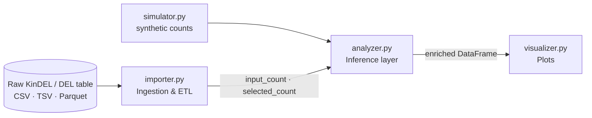

# Developer guide: DEL Bayesian enrichment

This document explains how code under [`src/`](src/) fits together, how [`main.py`](main.py) orchestrates validation vs production runs, and which applied data-engineering choices keep **million-row** KinDEL-scale workloads tractable. It is aimed at engineers extending the pipeline beyond a synthetic prototype.

---

## 1. Repository layout

The repo is organized as a **flat root** with a thin CLI entrypoint and a `src/` package for ingestion, inference, and visualization.

```
bayesian-del-signal-analysis/
  main.py                 # CLI: validation (--demo) vs production (--input)
  requirements.txt
  data/                   # local datasets (gitignored except .gitkeep)
  notebooks/              # production-scale exploration (Parquet, QC plots)
  scripts/                # optional setup helpers
  assets/                 # curated plots for README / docs
  out/                    # run outputs (typically gitignored)
  src/
    __init__.py           # package facade (re-exports public API)
    importer.py           # Ingestion & ETL: Parquet/CSV, schema mapping, depth normalization
    simulator.py          # Synthetic count generation (validation / teaching only)
    analyzer.py             # Statistical inference: Beta–Binomial posteriors, digamma means,
                          # trigamma delta-method uncertainty, scaffold pooling, triage
    visualizer.py         # Matplotlib / Seaborn plots from enriched tables
```

**Import rule:** use `from src.<module> import ...` with the **repo root** on `PYTHONPATH` (e.g. `python main.py` from the project root). [`src/__init__.py`](src/__init__.py) re-exports symbols for notebooks and downstream packages; it does not execute side effects.

---

## 2. Module architecture

End-to-end flow is **raw table → normalization / contract (ETL) → Bayesian enrichment → presentation**. Synthetic data bypasses real ingest but still lands on the same analyzer contract.



| Module | Layer | Role | Primary inputs | Primary outputs |
|--------|--------|------|----------------|------------------|
| [`importer.py`](src/importer.py) | **Ingestion & ETL** | **Parquet / delimited I/O**, KinDEL column aliasing (e.g. Parquet `seq_load` → `pre-selection_counts`), optional **depth scaling** across selected replicates (`LibraryScaler`), guards on replicate imbalance, standardized **`input_count` / `selected_count`**. | Path + `KinDELImportConfig` | `DataFrame` on the compound count contract |
| [`analyzer.py`](src/analyzer.py) | **Statistical inference** | Empirical Beta prior (MoM), conjugate Beta posteriors per compound (and optionally per scaffold), **digamma** closed form for $\mathbb{E}[\log_2(p_\mathrm{sel}/p_\mathrm{in})]$, **trigamma delta-method** (default) or batched MC for uncertainty and $P(\text{enriched})$, scaffold aggregation, **`final_triage_hits`**. | Count table + `BetaBinomialConfig` | Enriched `DataFrame` (+ optional scaffold table) |
| [`simulator.py`](src/simulator.py) | Validation | Plausible synthetic libraries for **`--demo`**; same columns the analyzer expects. | `SimulationConfig` | Count `DataFrame` |
| [`visualizer.py`](src/visualizer.py) | Presentation | Scatter, ranked enrichment, volcano-style view; **no** statistics—assumes columns already exist. | `DataFrame` + column names | `matplotlib.figure.Figure` / PNG |

There is no shared mutable runtime: each stage receives data explicitly, which keeps tests and notebooks predictable.

---

## 3. Production-grade math

**Model (high level):** independent Beta posteriors for input and selected multinomial rates; conjugate updates from binomial totals. The **default point estimate** for base-2 log enrichment uses the **digamma identity** for $\mathbb{E}[\log p]$ when $p \sim \mathrm{Beta}(a,b)$.

**Digamma-based point estimate (per channel, base 2):**

$$
\mathbb{E}[\log_2(p)] = \frac{\psi(a) - \psi(a+b)}{\ln(2)}
$$

For enrichment $\log_2(p_\mathrm{sel}/p_\mathrm{in})$ with **independent** posteriors on the two channels, the implementation uses the difference of the two expectations (each divided by $\ln 2$), matching $\mathbb{E}[\log p_\mathrm{sel}] - \mathbb{E}[\log p_\mathrm{in}]$ in natural log, then expressed in $\log_2$.

**Trigamma-based delta method (uncertainty, default production path):** for $\log p$ under the same Beta posterior, a standard delta-method variance uses **polygamma of order 1** (trigamma $\psi_1$). Converting to $\log_2$ scales variance by $1/(\ln 2)^2$:

$$
\mathrm{Var}[\log_2(p)] \approx \frac{\psi_1(a) - \psi_1(a+b)}{(\ln 2)^2}
$$

Under independence of input vs selected posteriors, the variance of $\log(p_\mathrm{sel}/p_\mathrm{in})$ is the **sum** of the two natural-log variances; the code applies the same scaling to obtain a Normal approximation for credible intervals and a **Normal CDF** proxy for $P(\log_2\text{enrichment} > 0)$. This is **not** a full hierarchical MCMC treatment—it is a deliberate **applied** trade-off: **vectorized $O(n)$ memory** vs storing an $(\text{MC samples} \times n)$ object.

**`BetaBinomialConfig.uncertainty_mode`:** `"delta"` is the **production default** (fast, memory-safe). `"mc_batched"` remains available for comparison; `"none"` drops uncertainty columns when only point estimates matter. Large MC paths can **auto-fallback** to delta when estimated batch allocations would exceed a safety budget (see `mc_auto_fallback_max_bytes` in [`analyzer.py`](src/analyzer.py)).

---

## 4. High-volume data handling

At **1M+** compound rows, naive patterns (duplicate wide frames, scatter plots of every row, unbounded MC tensors) dominate cost. Observed production-style benchmark on the documented DDR1 path: **under ~60 seconds** wall time for enrichment with **default delta-method uncertainty**, with **peak resident memory ~1.45 GB** (see [`RESEARCH_NOTES.md`](RESEARCH_NOTES.md) and [`notebooks/real_world_exploration.ipynb`](notebooks/real_world_exploration.ipynb)).

**Strategies used or recommended in this repo:**

- **Columnar I/O via Parquet** — [`importer.read_table`](src/importer.py) reads `.parquet` / `.pq` with `pandas.read_parquet`, which is appropriate for wide KinDEL dumps and reduces parse overhead vs raw CSV at scale.
- **Explicit `gc.collect()` after large transformations** — notebook workflows drop heavy intermediates at phase boundaries so peak RSS does not retain dead large objects longer than necessary.
- **Hexbin density for QC visualization** — for million-point views, **hexbin** on 1D NumPy arrays avoids materializing a second full-width working frame purely for density (contrast with naive duplicated `DataFrame` scatter pipelines). Production **`visualizer.py`** still uses scatter-oriented plots for moderate **n**; reserve hexbin for exploratory / QC paths at very large **n**.

Together with **delta-mode** inference (no per-row MC tensor), these choices keep the system in an **$O(n)$ working-set** regime suitable for real KinDEL enrichment rather than tutorial-scale toy data.

---

## 5. Execution flow (`main.py`)

**Validation mode — `python main.py --demo`**

- Builds a synthetic library via **`simulate_del_experiment`**, assigns a toy **`scaffold_id`**, runs **`summarize_enrichment`** with default config, optional scaffold aggregation, **`merge_scaffold_enrichment`**, then hit listing and plots under `--outdir`.
- Use this to verify installs, plotting, and analyzer wiring **without** real data.

**Production mode — `python main.py --input <path> [--schema kindel] ...`**

- Loads real data via **`load_kindel_dataset`** (Parquet/CSV/TSV), applies **`KinDELImportConfig`** (min counts, replicate scaling, scaffold column options, imbalance guardrails).
- Runs the **same** **`summarize_enrichment`** path as the demo; scaffold aggregation runs when **`scaffold_id`** is present after import.
- **Uncertainty** can be overridden with `--uncertainty-mode delta|mc_batched|none` (default follows **`BetaBinomialConfig`**, i.e. **delta**).

**Bayesian shield triage**

- After enrichment, **`final_triage_hits`** ranks compounds that pass **strong posterior evidence**: rows with **`prob_enriched` strictly greater than** the configured threshold (CLI **`--hit-prob-min`**, default **0.95**), then sorts by **`log2_enrichment_mean`** and keeps the top **K** (`--hits`).
- If **no** rows pass the gate, the pipeline **falls back** to **`top_hits`** on score alone so the run still emits a non-empty **`top_hits.csv`** for inspection. Treat the triage gate as a **deliberate filter** against low-count noise (the “Bayesian shield”), not as a hard crash when the library is ambiguous.

---

## 6. Data contract (compound table)

Downstream inference assumes a tidy table with at least:

- **`input_count`**, **`selected_count`**: non-negative integers consistent with the library totals the analyzer uses.
- Optional **`scaffold_id`** for family-level **`aggregate_enrichment_by_scaffold`**.

The analyzer recomputes **`total_input`** and **`total_selected`** as column sums each run; preserve that invariant if you add new loaders.

---

## 7. Configuration knobs worth knowing

[`BetaBinomialConfig`](src/analyzer.py):

- **`use_empirical_prior`**: library-wide MoM Beta prior vs fixed **`alpha_prior` / `beta_prior`**.
- **`uncertainty_mode`**: **`"delta"`** (default), **`"mc_batched"`**, or **`"none"`**.
- **`mc_samples` / `mc_batch_size`**: MC cost and RAM when MC is enabled (`O(\text{mc_samples} \times \text{batch})$-style working set per batch).

[`KinDELImportConfig`](src/importer.py): column names, **`selected_aggregation`** (`sum_raw` vs **`sum_scaled_depth`**), depth target, min counts, replicate imbalance cap, scaffold derivation.

[`SimulationConfig`](src/simulator.py): synthetic library shape only; it does not change analyzer math beyond the counts you pass in.

---

## 8. Extension patterns

| Goal | Suggested change |
|------|------------------|
| Real DEL counts | Use **`importer.py`** or add a loader that emits **`input_count` / `selected_count`**; call **`summarize_enrichment`** unchanged. |
| Different prior | Set **`use_empirical_prior=False`** and tune priors, or extend **`estimate_empirical_beta_prior`** with a documented alternative. |
| Faster runs at huge **n** | Keep **`uncertainty_mode="delta"`**; avoid MC unless you need sampling-based intervals for comparison. |
| New plots | Add functions in **`visualizer.py`**; keep plotting out of **`analyzer.py`** to limit import cycles and test weight. |

---

## 9. Related reading

- [`RESEARCH_NOTES.md`](RESEARCH_NOTES.md) — digamma / trigamma derivations, empirical prior rationale, batched MC vs delta method, performance notes.
- [`README.md`](README.md) — user-facing overview (may lag layout details; prefer this guide + source for contracts).
