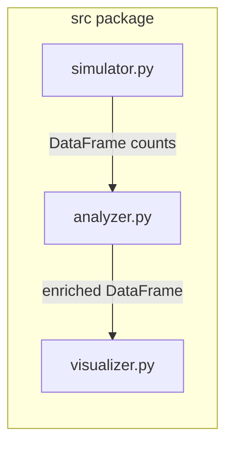

# Developer guide: DEL Bayesian Enrichment

This document explains how code under [`src/`](src/) fits together and how [`main.py`](main.py) wires a minimal end-to-end DEL-style analysis. It is aimed at engineers extending the prototype.

---

## 1. Layout and execution model

```
bayesian-del-signal-analysis/
  main.py              # CLI + demo orchestration
  assets/              # curated plots for README/GitHub
  out/                 # demo outputs (ignored by git)
  src/
    __init__.py        # Package facade (re-exports public API)
    importer.py        # Real-world ingestion (KinDEL schema → standardized count columns)
    simulator.py       # Synthetic count generation
    analyzer.py        # Beta-Binomial priors, digamma mean, batched MC uncertainty, scaffolds
    visualizer.py      # Matplotlib/Seaborn plots from enriched tables
```

**Import rule:** `main.py` uses imports such as `from src.analyzer import ...`. That works when the directory that **contains** the `src/` folder is on `sys.path`. In practice:

- Run from the repo root: `python main.py --demo`.

[`src/__init__.py`](src/__init__.py) does not auto-run anything; it only re-exports symbols so notebooks or other packages can do `import src` and get a stable surface.

---

## 2. How the modules relate



| Module | Role | Primary inputs | Primary outputs |
|--------|------|----------------|------------------|
| [`simulator.py`](src/simulator.py) | Generate plausible **input** and **selected** read counts per compound (hits vs background, overdispersion, multinomial reallocation to library size). | `SimulationConfig` | `DataFrame` with `compound_id`, `is_hit`, `input_count`, `selected_count`, etc. |
| [`importer.py`](src/importer.py) | Ingest real-world KinDEL tables: map schema columns → standardized `input_count`/`selected_count`, optional depth normalization across selected replicates, and common missing/low-count handling. | CSV/Parquet table + `KinDELImportConfig` | `DataFrame` suitable for `summarize_enrichment`. |
| [`analyzer.py`](src/analyzer.py) | **Inference:** empirical Beta prior (MoM on a library proxy), conjugate Beta posteriors per compound, **digamma** closed form for `log2_enrichment_mean`, optional **batched** MC for CIs and `prob_enriched`, scaffold pooling + merge. | Count table + `BetaBinomialConfig` | Same rows plus enrichment columns; optional scaffold summary table. |
| [`visualizer.py`](src/visualizer.py) | **Presentation:** scatter, ranked enrichment, volcano-style plot. No statistics; assumes columns already exist. | `DataFrame` + column names | `matplotlib.figure.Figure`; optional PNG path. |

There is no shared runtime state: each function receives data explicitly, which keeps testing and notebook use straightforward.

**Primary point estimator (base-2):** for \(p \sim \mathrm{Beta}(a,b)\),
\[
\mathbb{E}[\log_2(p)] = \frac{\psi(a) - \psi(a+b)}{\ln(2)},
\]
so \(\mathbb{E}[\log_2(p_\mathrm{sel}/p_\mathrm{in})]\) is computed as a difference of those expectations (digamma). Monte Carlo is reserved for credible intervals and \(P(\log_2(\cdot) > 0)\).

---

## 3. `main.py`: orchestration of the demo pipeline

[`main.py`](main.py) is the **composition root** for the shipped demo. `run_demo(outdir)` performs a fixed sequence:

1. **`simulate_del_experiment(SimulationConfig())`**  
   Produces a compound-level count table (simulated DEL).

2. **Synthetic `scaffold_id`**  
   For illustration only (`compound_id // 500`). Real pipelines should supply a chemical scaffold key from structure or encoding metadata.

3. **`summarize_enrichment(df, BetaBinomialConfig())`**  
   Adds `log2_enrichment_mean` (digamma), and unless `uncertainty_mode="none"`, also `log2_enrichment_ci_*` and `prob_enriched` (batched MC).

4. **`aggregate_enrichment_by_scaffold(df2, ...)`**  
   Sums counts per scaffold, applies the **same** inference recipe at scaffold granularity, emits `scaffold_log2_enrichment`.

5. **`merge_scaffold_enrichment(df2, sc)`**  
   Joins scaffold-level signal back onto each compound row for plotting or export.

6. **`top_hits(df2, k=50)`**  
   Ranks by `log2_enrichment_mean` and writes a small CSV.

7. **Plotting**  
   `plot_enrichment_scatter`, `plot_ranked_enrichment`, `plot_volcano` write PNGs under `outdir`.

`main()` only parses CLI flags and delegates to `run_demo` (simulation) or a real-world ingest path (currently KinDEL via `src/importer.py`). There is no plugin system: to add stages (e.g. real FASTQ ingestion), extend the orchestration functions or add new entrypoints alongside `main.py`.

---

## 4. Data contract (compound table)

Downstream code assumes a tidy table with at least:

- `input_count`, `selected_count`: non-negative integers summing to library totals used by the analyzer.
- Optional: `scaffold_id` for family-level aggregation.

The analyzer derives `total_input` and `total_selected` as **column sums** each time it runs; keep that invariant if you replace the simulator with real data loaders.

---

## 5. Configuration knobs worth knowing

[`BetaBinomialConfig`](src/analyzer.py) centralizes behavior:

- **`use_empirical_prior`**: library-wide MoM Beta prior vs fixed `alpha_prior` / `beta_prior`.
- **`uncertainty_mode`**: `"mc_batched"` (default) vs `"none"` for large **n** when only point estimates are needed.
- **`mc_batch_size`**: caps peak RAM for uncertainty (`O(mc_samples × mc_batch_size)`).

[`SimulationConfig`](src/simulator.py) controls synthetic library size, hit count, and noise; it does not affect the analyzer’s math beyond the shape of the counts you pass in.

---

## 6. Extension patterns

| Goal | Suggested change |
|------|------------------|
| Real DEL counts | Use `src/importer.py` (KinDEL) or add a loader that emits the same `input_count`/`selected_count` contract; call `summarize_enrichment` unchanged. |
| Different prior | Set `use_empirical_prior=False` and tune `alpha_prior` / `beta_prior`, or extend `estimate_empirical_beta_prior` with a documented alternative. |
| Faster demos | Lower `mc_samples` or use `uncertainty_mode="none"` during development. |
| New plots | Add functions in `visualizer.py` that read enrichment columns; keep plotting separate from `analyzer.py` to avoid circular imports and heavy deps in tests. |

---

## 7. Related reading

- [`RESEARCH_NOTES.md`](RESEARCH_NOTES.md) — rationale for digamma means, MoM priors, and batched MC (methods / lessons learned angle).
