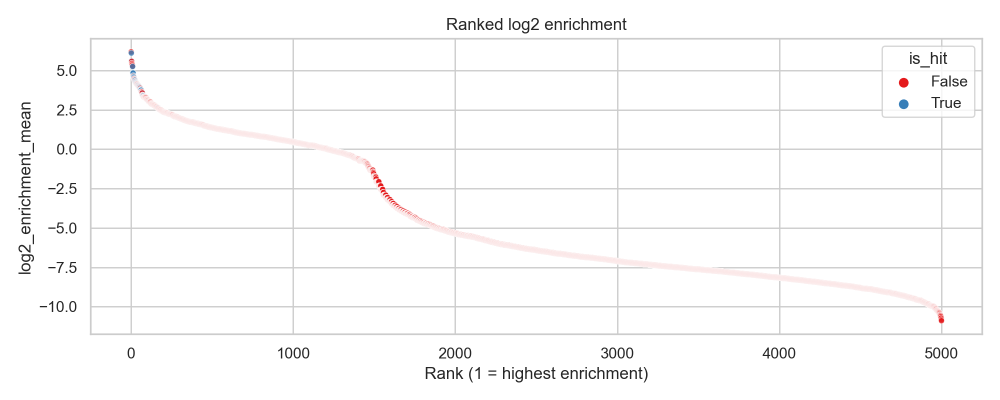
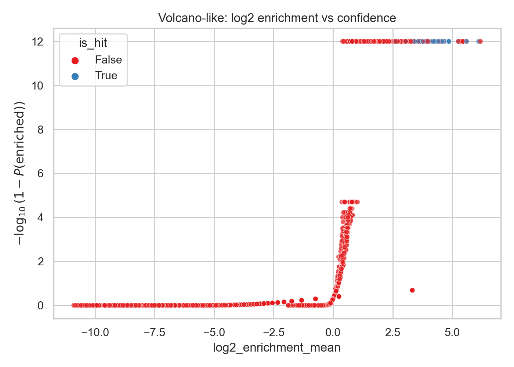

# DEL Bayesian Enrichment

Lightweight toolkit for simulating DNA-Encoded Library (DEL) selection experiments and analyzing enrichment using a Beta-Binomial Bayesian model.

## What’s included
- `src/simulator.py`: Standard DEL-style simulation (counts, selection, amplification/noise)
- `src/analyzer.py`: Beta-Binomial Bayesian enrichment inference with credible intervals
- `src/visualizer.py`: Common enrichment plots (ranked enrichment, scatter, volcano-like)
- `main.py`: Simple entry point to simulate + analyze + plot

## Quickstart

Create a virtual environment, then install dependencies:

```bash
pip install -r requirements.txt
```

Run the demo pipeline:

```bash
python main.py --demo
```

Outputs (CSV + plots) are written to `out/` by default.

## Results Showcase

Ranked Bayesian enrichment (blue “Hits” are simulated high-confidence binders surfaced via Bayesian shrinkage):



Volcano-like view of enrichment vs signal strength (blue “Hits” are simulated high-confidence binders surfaced via Bayesian shrinkage):



## How it Works

We model **input** and **selected** read counts as noisy observations of underlying per-compound rates. Using a **Beta prior** with a **Binomial likelihood**, each compound’s input and selected rates have conjugate **Beta posteriors**. Enrichment is summarized as the posterior expectation of log fold-change:

- **Analytical mean (fast)**: the expected log enrichment uses the closed form \(E[\log p] = \psi(a) - \psi(a+b)\) (digamma), giving a stable point estimate without slow Monte Carlo.
- **Uncertainty (optional)**: credible intervals and \(P(\log_2 \text{enrichment} > 0)\) can be estimated via batched Monte Carlo sampling when needed.

## Project layout

```
bayesian-del-signal-analysis/
  assets/             # curated plots for README/GitHub
  data/
  notebooks/
  out/                # demo outputs (ignored by git)
  main.py             # CLI entry point (demo orchestration)
  src/
  requirements.txt
```

## Notes
- The point estimate for enrichment uses an analytical digamma identity; Monte Carlo is only used for uncertainty summaries when enabled.
- Run `python main.py --demo` from the repo root so `src` resolves as a package.
- This is intentionally minimal boilerplate you can extend with real DEL preprocessing and multi-round models.

